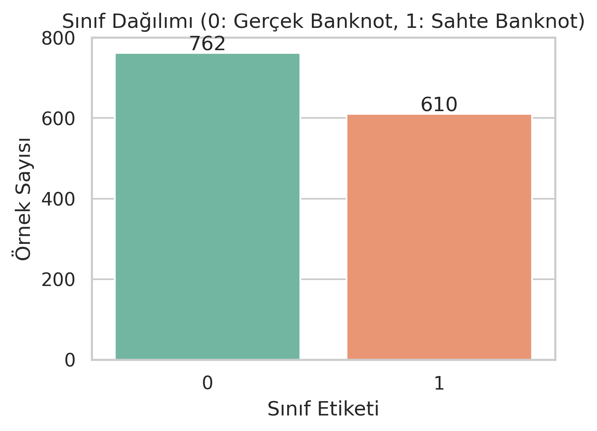
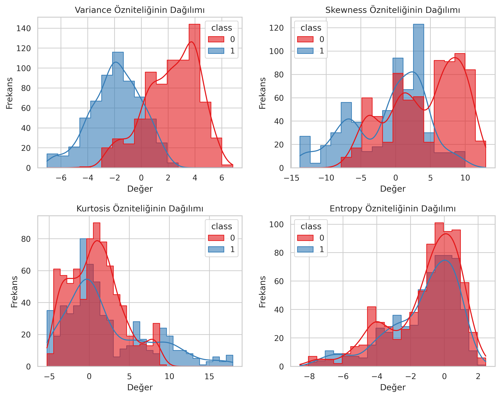
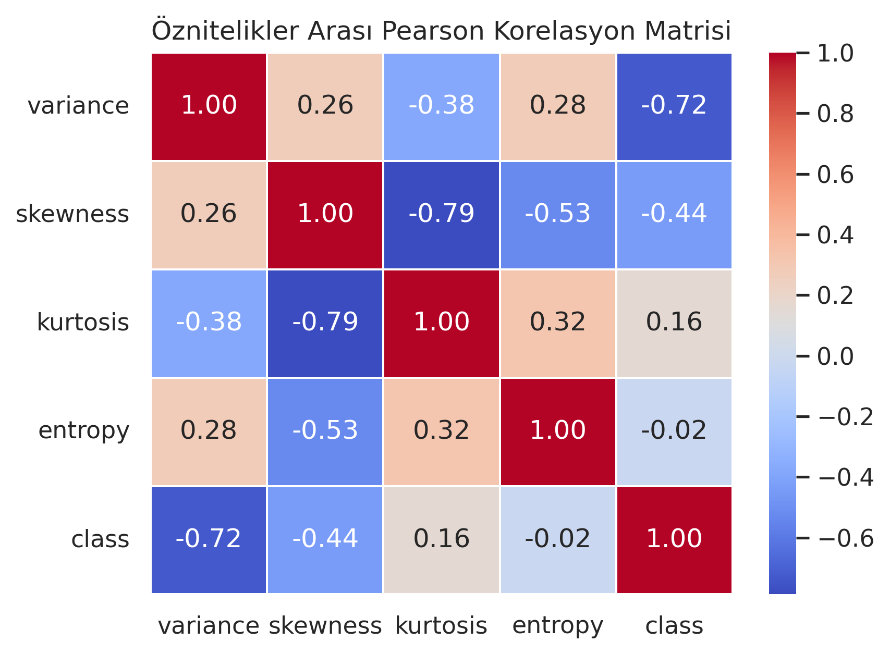
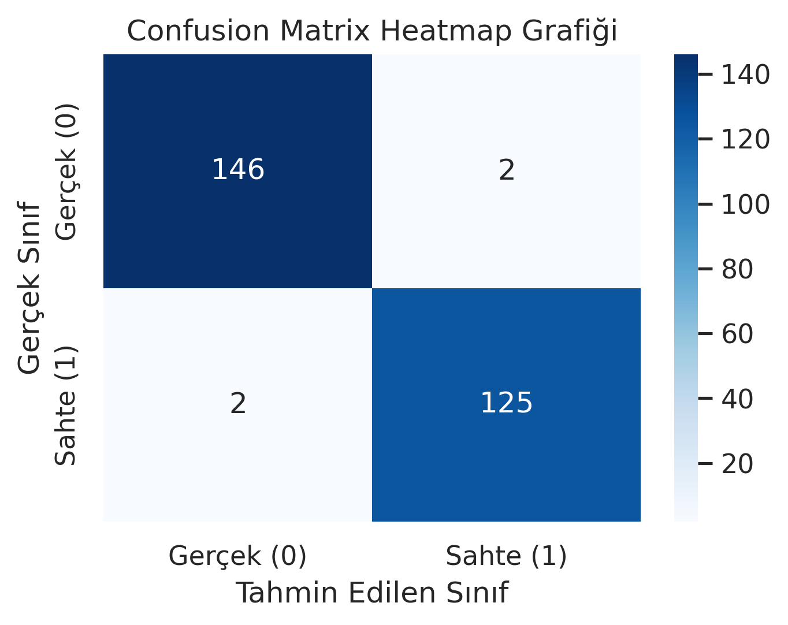
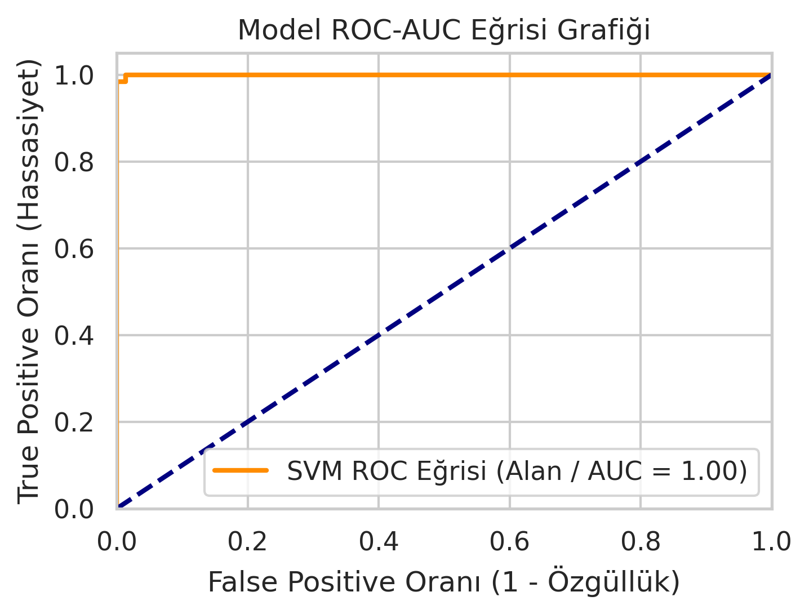

# Support Vector Machines (SVM) ile Banknot Doğrulama ve Sahte Para Tespiti

Bu proje, UCI Machine Learning Repository üzerinde yer alan Banknote Authentication Dataset kullanılarak, gerçek ve sahte banknotların Destek Vektör Makineleri (SVM) algoritması ile yüksek doğrulukta sınıflandırılmasını amaçlamaktadır. Proje kapsamında keşifsel veri analizi (EDA), veri ön işleme, model eğitimi, çapraz doğrulama ve literatür karşılaştırması adımları yürütülmüştür.

## Proje Yapısı ve Akışı
Not defteri (Notebook) mimarisi, akademik standartlara ve yeniden üretilebilirlik (reproducibility) kriterlerine uygun olarak şu sıralamayı takip etmektedir:
1. Kütüphanelerin Yüklenmesi & Verinin Canlı Okunması: Veri seti, yerel dosya bağımlılıklarını ortadan kaldırmak amacıyla doğrudan UCI sunucularından canlı URL bağlantısı ile çekilmektedir.
2. Keşifsel Veri Analizi (EDA): Sınıf dağılımları, öznitelik histogramları, Pearson korelasyon matrisi ve aykırı değer (boxplot) analizleri grafiksel olarak kurgulanmıştır.
3. Veri Bölme (Train/Test Split): Bağımsız değişkenler (X) ve hedef bağımlı değişken (y) matris formuna getirilerek %80 eğitim ve %20 test olacak şekilde hold-out stratejisiyle ayrılmıştır.
4. Model Eğitimi & Performans Ölçümü: Doğrusal karar sınırlarının performansını ölçmek amacıyla linear çekirdek mimarisi eğitilmiş; Accuracy, Precision, Sensitivity, Specificity ve F1-Score değerleri Karışıklık Matrisi (Confusion Matrix) elemanları üzerinden matematiksel formüllerle hesaplanmıştır.
5. ROC-AUC Analizi: Modelin sınıf ayırma gücü ROC eğrisiyle görselleştirilmiştir.
6. Alternatif Çekirdek (Kernel) Karşılaştırması: Linear, RBF ve Poly çekirdek fonksiyonlarının başarıları döngüsel olarak kıyaslanmış ve sütun grafiği ile raporlanmıştır.
7. Çapraz Doğrulama (Cross Validation): Modelin kararlılığını ve genelleme kabiliyetini test etmek amacıyla 10-Fold Çapraz Doğrulama analizi uygulanmıştır.

## Elde Edilen Deneysel Sonuçlar

Linear SVM modeli ile test verisi üzerinde elde edilen kesin performans metrikleri aşağıdadır:

| Performans Ölçütü | Matematiksel Formülü | Elde Edilen Başarı Oranı |
| :--- | :---: | :---: |
| **Accuracy (Doğruluk)** | (TP + TN) / (TP + TN + FP + FN) | **%98.55** |
| **Precision (Kesinlik)** | TP / (TP + FP) | **%98.43** |
| **Sensitivity (Hassasiyet / Recall)** | TP / (TP + FN) | **%98.43** |
| **Specificity (Özgüllük)** | TN / (TN + FP) | **%98.65** |
| **F1-Score** | 2 × (Precision × Recall) / (Precision + Recall) | **%98.43** |
| **ROC-AUC** | Area Under Curve | **1.00** |

### 10-Katlı Çapraz Doğrulama (10-Fold Cross Validation) Sonuçları
* Ortalama Doğruluk: %98.76
* Standart Sapma: %0.98

### Çekirdek (Kernel) Karşılaştırması
* SVM (LINEAR) Doğruluğu: %98.55
* SVM (RBF) Doğruluğu: %100.00
* SVM (POLY) Doğruluğu: %97.45

## Görselleştirmeler ve Grafikler

Proje adımlarında üretilen ve `images` klasöründe yer alan analiz grafikleri aşağıda sırasıyla listelenmiştir:

### Veri Seti Sınıf Dağılımı


### Öznitelik Dağılım Histogramları


### Pearson Korelasyon Matrisi


### Aykırı Değer Analizi (Boxplot)


### Karışıklık Matrisi (Confusion Matrix Heatmap)


### ROC Eğrisi (ROC Curve)


### Çekirdek Fonksiyonları Başarı Karşılaştırması


## Kullanılan Teknolojiler ve Hiper-Parametreler
Projenin tamamen yeniden üretilebilmesi için gerekli kütüphane sürümleri ve model parametreleri şu şekildedir:
* Dil / Ortam: Python 3 (Google Colab / Jupyter Notebook)
* Temel Kütüphaneler: pandas, numpy, scikit-learn, matplotlib, seaborn
* Train-Test Dağılımı: %80 - %20 (test_size=0.20, random_state=42)
* Model Hiper-Parametreleri: kernel='linear', C=1.0, gamma='scale', random_state=42

## Kurulum ve Çalıştırma
Projeyi kendi yerel ortamınızda veya Google Colab üzerinde çalıştırmak için aşağıdaki adımları takip edebilirsiniz:

1. Bu depoyu yerel bilgisayarınıza kopyalayın:
```bash
git clone [https://github.com/mlkyzgt/Banknote-Authentication-SVM.git](https://github.com/mlkyzgt/Banknote-Authentication-SVM.git)

2. Gerekli bağımlılıkları yükleyin:
pip install pandas numpy scikit-learn matplotlib seaborn

3. Banknote_Authentication_SVM.ipynb dosyasını Jupyter Notebook veya Google Colab üzerinde açarak tüm hücreleri sırasıyla çalıştırın.

## Kaynakça
Dua, D. and Graff, C. UCI Machine Learning Repository. University of California, Irvine, School of Information and Computer Sciences. URL: https://archive.ics.uci.edu/ml

Shahani, S., Jagiasi, A., Priya, R. L. (2018). Analysis of Banknote Authentication System using Machine Learning Techniques. International Journal of Computer Applications, 179(20), 22-26.
